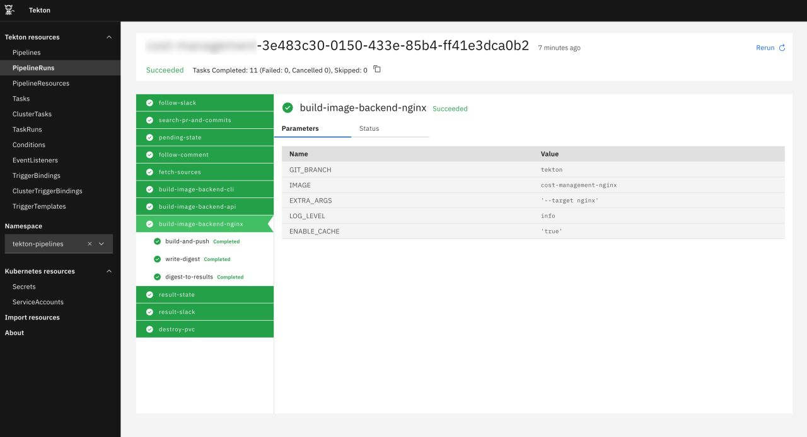
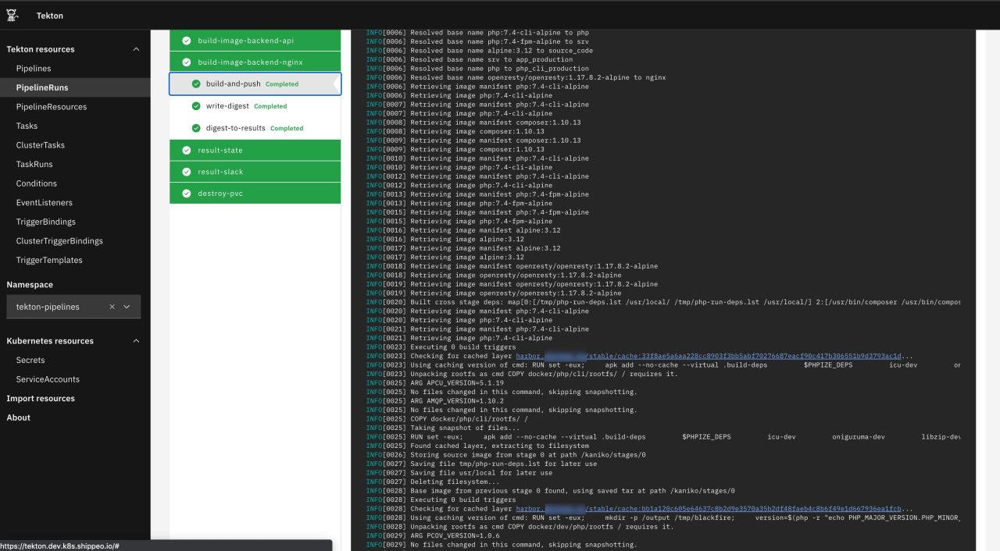
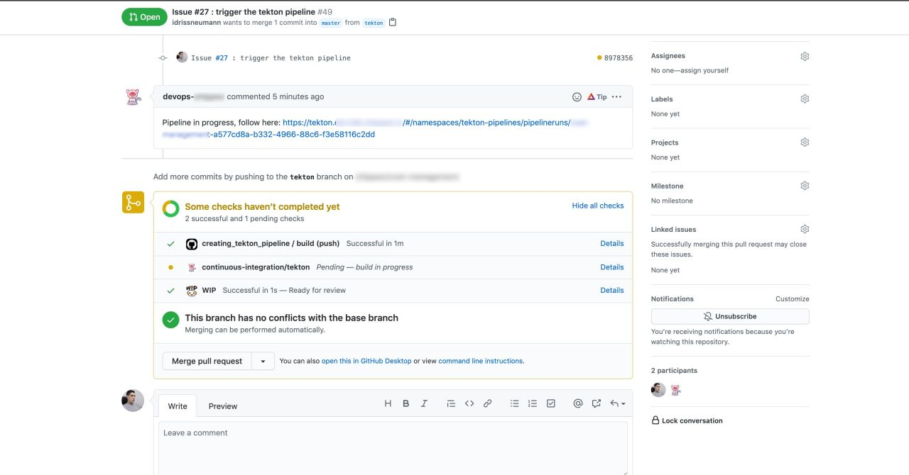

# Tekton tasks images

Some cloud native images that will handle for you some common tekton tasks like:

* Slack publishing
* Github comment on pull requests
* Etc

Some of the tasks are picked from the [tekton catalog](https://github.com/tektoncd/catalog) and updated a little bit.

## Git repositories

* Main repo: https://gitlab.comwork.io/oss/tekton-task-images
* Github backup mirror: https://github.com/idrissneumann/tekton-task-images

## Docker registry

The tasks are available on docker hub, you just have to pull it like that:

```shell
$ docker pull comworkio/tekton-utils-{task name}
# for example:
$ docker pull comworkio/tekton-utils-slack-sender
```

## How to use it

For each directory which corresponds to one task, you'll find a README file that will enumerate all the environment variables you need.

Sometimes you'll even find a tekton task yaml example in those directories.

For each environment variable, you need to set it from Task parameter like that:

```yaml
env:
  - name: LOG_LEVEL
    value: $(params.LOG_LEVEL)
```

Or from a secret like that:

```yaml
env:
  - name: GITHUBTOKEN
    valueFrom:
    secretKeyRef:
      name: github-access
      key: password
```

Or from a workspace (tekton shared volume) like that:

```yaml
env:
  - name: TEKTON_WORKSPACE_PATH
    value: $(workspaces.NAME_OF_YOUR_WORKSPACE.path)
```

## The result of those tasks in action

Here's some screenshots of how those tasks help us to achieve beautiful and working tekton pipelines.







